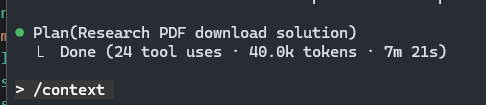
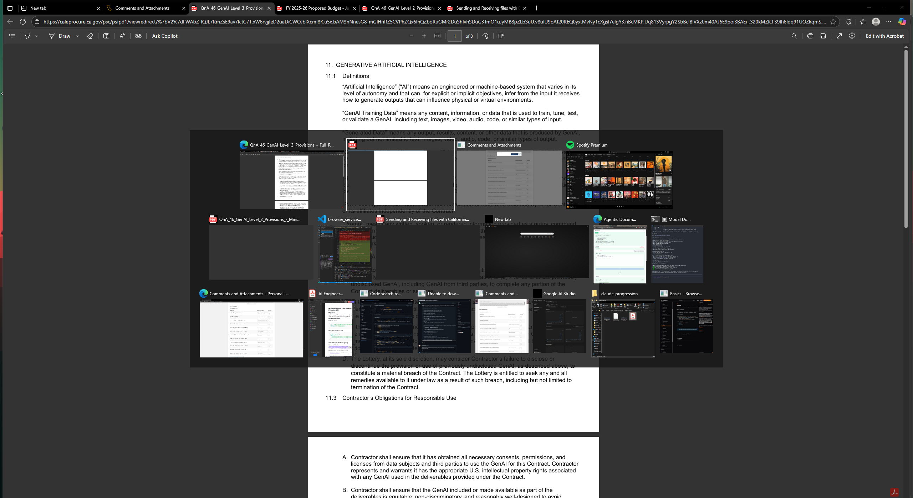
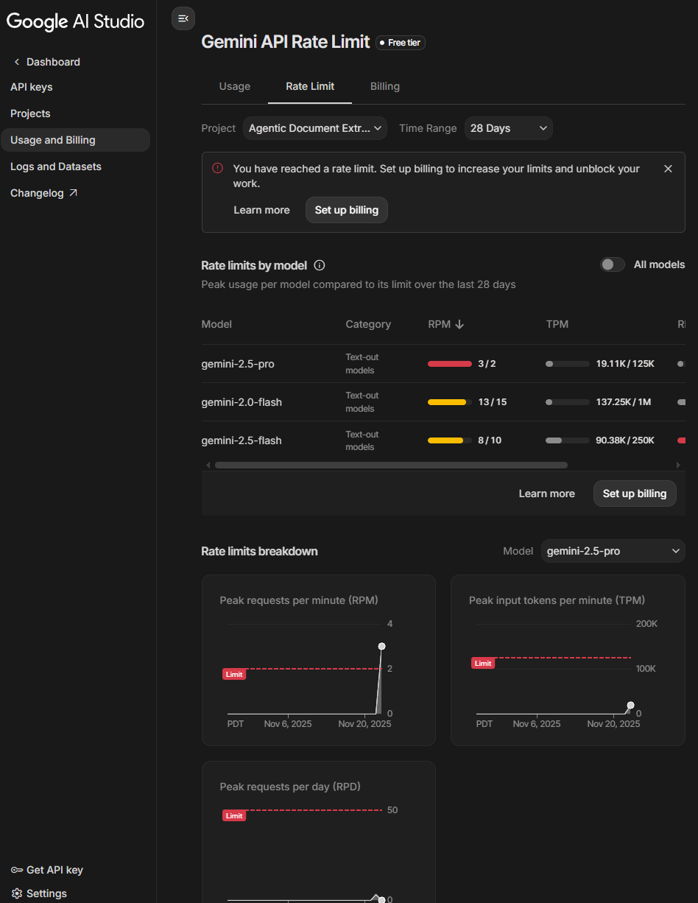

# Everything to do with my and this project's progression.

# Working on this project

## Claude couldn't get right:

Used wrongly Google AI with wrong lib: langchanin... instead of importing
GoogleChat from browser_use...

in caleprocure - the PDFs are not automatically downloaded but pop up in a new window.
This is something Claude struggled with until I updated the web-search's llm prompt.

### Hit limit:

### 40k tokens research smh

## Problem with popped-up PDFs

Ok, 12hrs older Ilan here (I slept), this turns to be a much bigger issue as browser-use can't download those pdfs because it cannot find the downloading button which is out of the browser and in the browser tools. Anyways, I (Claude) coded a tool to download them using playwright API. Which after lots of adjustments started to work (Browser-use just didn't use the tool or I didn't config it correctly).

13:57 Downloaded popped-up PDF for the first time! (It didn't work for next ones)

More adjustments now... Btw, tabs game is insane rn:

16:13 I hit my Claude Code limit once again, though I really tried to keep the context window small and not overly use it. It resets in 40 minutes so I will use Copilot Agent for now / Codex for now.

16:43 Switched to Codex
16:44 Realized my Copilot Subscription is not enough
17:22 Switching Browser Use agent to GPT-4o even though flash is required. I hit my limit.

Looks like GPT is not so smart, changed to gemini - paying for usage.

## Model usage conclusion

It appears not all models are equal. Not at all and lot of time **was spent dumblessly to try and do stuff using other models**. F.e. changing to copilot or to gpt-4o as browser use agent was completely useless as they took me back than forward.

## Finish

At 20:40 I hit my Claude Code limit again, expressing my anger on a crash happening after I told Claude Code it'll happen. I almost Ctrl+C'd it but the fallback worked! All the files were downloaded! This will be in the Demo!

# Learning about Clade Code

> All was done in a scope of 24hrs. In reality I worked:
>
> - from 9pm to 1am
> - 12am to 8pm (next day)

## Some stuff I learned 'bout Claude Code

Create a plan first before big work

`/memory`

You can edit:

1. user memory in CLAUDE.md in .claude folder in ...
2. project memory in CLAUDE.md in project

**For big plans use :** "Make the plan multi-phase"

`/context`

See how much context is left for you

If context is ending -> You can ask claude code to create a github issue and check whats have been done, ...

`/clear` - clear context window

`claude --continue` if u exited the session

**My workflow with this project:**

1. Understand the task & whats setup required
2. Download whats needed and start building using phases
